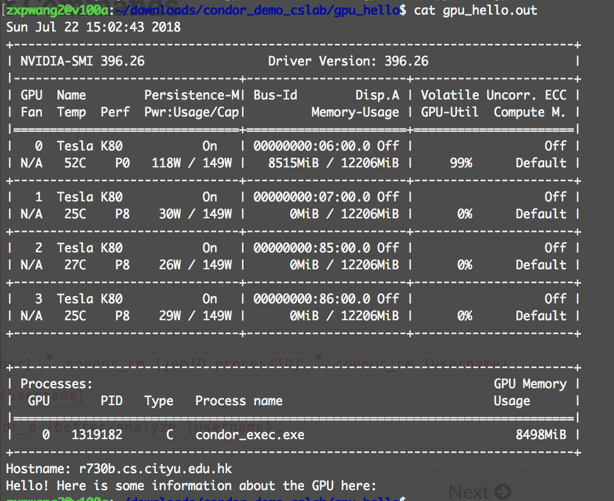
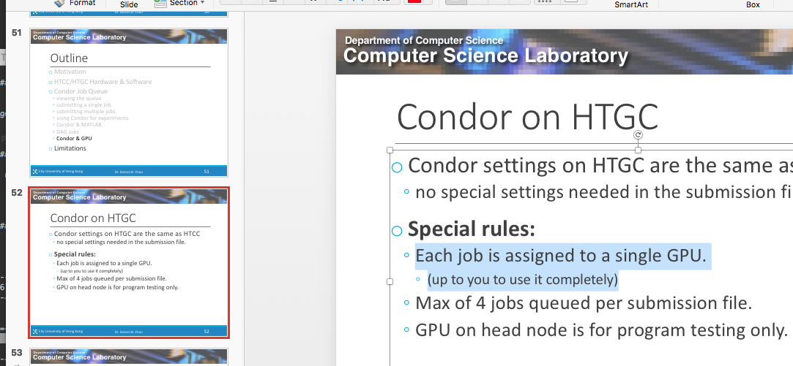

# About Manual Device Placement in HTGC

# Observations

1. When we ``condor_submit`` a job with ``nvidia-smi`` to query the GPU
status, typically we will see something like the picture below:

It seems we have four nodes available from the whole cluster. We
natually thought we can manually assign tasks to those four nodes.

2. If we do not specify device placement options, the tasks are 
generally assigned to ``GPU:0``.

3. If we attempt to specify to use ``CPU:0`` for some operations, no 
problem.

4. If we attempt to specify to use ``GPU:0`` for some operations, no 
prblem.

5. If we attempt to specify to use ``GPU:2`` or ``GPU:3`` for some oeprations, at the same time, we set ``allow_soft_placement`` to 
True in the configuration option when creating the session, in the end 
``GPU:0`` will be used.

6. If we attemp to specify to use ``GPU:2`` or ``GPU:3`` for some
operations, but without ``allow_soft_placement`` set to True, the
program will abort with error of device avilability. (You 
will find info in ``*.err`` file which indicates that you are trying to use some 
device that is not available.)

7. And, there is one point in the **HTCC&HTGC tutorial slides** from
**abchan**:

> Each job is assigned to a single GPU. -- abchan

# Conclusions

Each job can only use a single GPU. By default that single GPU is called
``GPU:0``. The default cannot be overwirtten. TF Manual Device Placement
is not applicable to HTGC.
